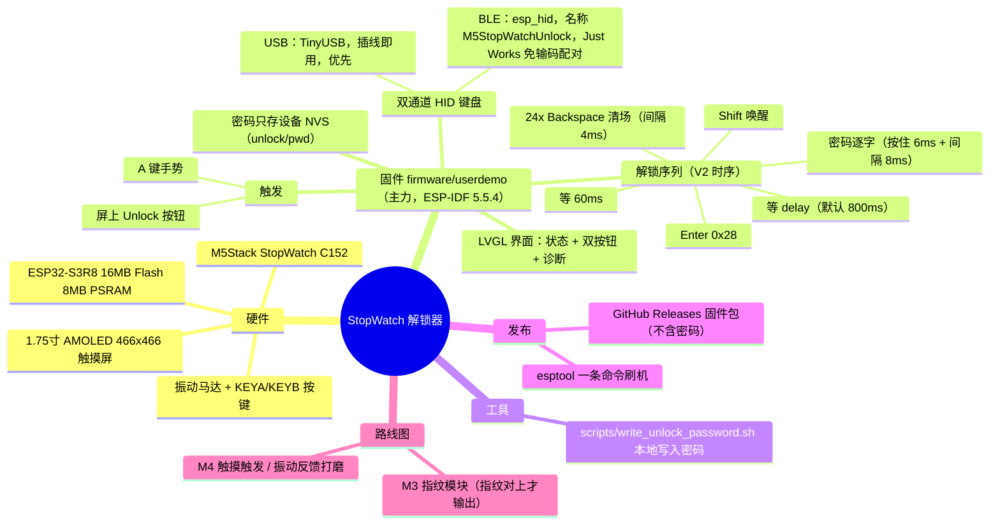

# StopWatch 一键解锁（stopwatch-unlock）

用 **M5Stack StopWatch（SKU C152）** 做的 macOS 一键解锁器：锁屏界面按下设备按钮，它伪装成一把 USB / 蓝牙键盘，自动「打出密码 + 回车」，1.5 秒内解锁进入桌面。这是「外置指纹识别器」方案的软件替代实现 —— 在 macOS 看来它就是一把普通键盘。

> ⚠️ **安全约定（先读）**：本仓库、固件、文档中**永远不包含任何真实密码**。密码只由你自己写入你自己的设备（见 [写入你的密码](#三写入你的密码)），全程不经过任何第三方。

---

## 脑图（当前架构）



---

## 一、项目运行与设计

### 1.1 为什么必须用硬件键盘

macOS 锁屏界面（loginwindow / SecurityAgent）运行在独立的安全上下文里：

- AppleScript、辅助功能、CGEvent 合成事件**全部无法**向密码框注入按键；
- 锁屏界面下后台程序也收不到键盘事件，「Mac 装软件监听按键自动输入」走不通；
- 系统只接受**真实硬件输入** —— 即 USB / 蓝牙 HID 键盘级别的事件。

所以方案是：让 StopWatch 直接扮演 HID 键盘（与视频里那个「外置指纹识别器」同构）。

### 1.2 双通道设计

| 通道 | 实现 | 特点 |
|---|---|---|
| USB | TinyUSB HID 键盘（ESP32-S3 原生 USB） | 插线即用、即时响应、睡眠唤醒后几乎立刻可用 —— **优先通道** |
| BLE | esp_hid BLE HID 键盘，广播名 `M5StopWatchUnlock` | 无线；与 Mac「Just Works」配对（设备无屏幕输码 UI，已改为免输码）；唤醒后重连需 1~2 秒 |

固件运行时优先走 USB（`tud_connected()`），USB 未连接自动切 BLE。

### 1.3 解锁序列（V2 时序，实测可解开 macOS 锁屏）

```text
[触发] 屏上按钮 / A 键手势
  ↓
Shift 按下并松开            ← 唤醒锁屏输入框
  ↓ 等待 press_delay（默认 800ms，NVS 可配）
24 × Backspace（每键按住 6ms，间隔 4ms） ← 清空输入框残留
  ↓ 等 60ms
密码逐字输入（每字按住 6ms，字符间隔 8ms）
  ↓ 等 60ms
Enter（HID 用法码 0x28，按住 6ms）      ← 注意不是小键盘 0x9E
```

> 踩过的坑（已修复，也是本仓库存在的意义）：Enter 必须用 `0x28`（主键盘 Enter），`0x9E` 是小键盘回车，macOS 锁屏不认；瞬时 `write()` 的回车会被吞，必须 press→hold→release；BLE 报告描述符必须声明 6 键滚动。

### 1.4 密码存储

- 密码只存在**设备本地的 NVS 分区**（namespace `unlock`，key `pwd`，另可配 `delay`）；
- 出厂固件里没有任何密码，未写密码时触发按键是惰性的（界面显示 Password MISSING）；
- 上位机不装任何软件，Mac 端零依赖。

### 1.5 界面与诊断

设备屏幕（LVGL）显示：密码状态、USB 初始化结果、BLE 广播/连接状态、最近一次 Enter 发送结果，双按钮分别触发 USB / BLE 通道，方便单独排查。

### 1.6 目录结构

```text
stopwatch-unlock/
├── README.md                          ← 本文件
├── docs/
│   └── 需求整理-一键解锁.md            ← 原始需求文档（方案选型依据）
├── firmware/
│   ├── userdemo/                      ← 主力固件（当前设备上跑的版本，ESP-IDF 5.5.4）
│   │   ├── main/unlock_module.c       ← 双通道解锁核心（序列/时序/NVS/诊断）
│   │   ├── main/apps/app_unlock/      ← 屏上解锁 App（按钮/状态/诊断）
│   │   ├── components/                ← vendored 组件（lvgl/M5GFX 等，必须随仓库走）
│   │   └── sdkconfig                  ← 已验证的配置（蓝牙/USB 已打开）
│   └── arduino-prototype/             ← Arduino 原型（USB 版 + BLE/USB 双模实验版）
└── scripts/
    └── write_unlock_password.sh       ← 用户把密码写进自己设备的脚本
```

### 1.7 从源码构建（需要改代码时才需要）

先决条件：ESP-IDF **v5.5.4**（components 已随仓库提供，无需额外下载）。

```bash
cd firmware/userdemo
export IDF_PATH=~/esp/esp-idf-v5.5.4      # 按你的安装路径调整
. $IDF_PATH/export.sh
idf.py build                              # 只编译验证
idf.py -p /dev/cu.usbmodem211XX flash     # 烧录（StopWatch 进下载模式：长按电源约 2 秒）
```

---

## 二、跨平台使用流程（换一台新 Mac）

### 2.1 先决条件

| 条件 | 说明 |
|---|---|
| macOS 锁屏可输密码 | 开机/锁屏界面能输入账户密码（Touch ID 和密码共用同一口令）；纯 **ASCII** 密码（HID 键码限制） |
| 单用户 | 默认按「密码框已聚焦」处理；多用户需先选用户（后续版本可配 ↓/Tab） |
| FileVault（可选） | 若开启，冷开机时 EFI 预引导界面同样接受 USB 键盘，但设备无法区分界面，冷开机按两次即可 |
| USB 口 / 蓝牙 | USB 通道任一 USB 口；BLE 通道需 Mac 蓝牙开启 |

### 2.2 操作步骤

```text
① 刷固件     → 用 Releases 里的固件包（见下节），或按 1.7 从源码构建
② USB 通道   → 数据线插上 Mac 即完成（系统信息里出现「USB Keyboard」）；无需驱动、无需装软件
③ BLE 通道   → 系统设置 → 蓝牙 → 点「M5StopWatchUnlock」→ Just Works 免输码直连
④ 写入密码   → 在任意一台电脑上运行 scripts/write_unlock_password.sh（见下节）
⑤ 测试       → Ctrl+Cmd+Q 锁屏 → 按设备屏上 Unlock 按钮 → 1.5 秒内解锁
```

注意：

- 睡眠唤醒后 **BLE** 需 1~2 秒重连，USB 几乎即时 —— 优先用 USB；
- 换 Mac 或重新配对时，先在旧 Mac 蓝牙设置里删除 `M5StopWatchUnlock` 的配对记录；
- 部分 Mac 深睡时断 USB 供电，唤醒瞬间设备需重新枚举（USB 自动，秒级）。

## 三、写入你的密码

密码**只进你自己的设备**，任何人（包括固件作者）都拿不到：

```bash
git clone https://github.com/xiaoshyang/stopwatch-unlock.git
cd stopwatch-unlock/scripts
./write_unlock_password.sh        # 提示输入密码，本机隐藏输入
# 设备需处于下载模式（长按电源约 2 秒），脚本会生成 NVS 镜像并写入 0x9000
```

脚本做的事：本地隐藏读取密码 → 生成 NVS 分区镜像 → `esptool` 写入设备 NVS → 立即从内存清除。密码不落盘、不联网、不进聊天记录。

---

## 四、固件发布方案

### 4.1 发布物（GitHub Releases）

每次发版附一个固件包，内含：

| 文件 | 烧录地址 | 说明 |
|---|---|---|
| `bootloader.bin` | `0x0` | 引导 |
| `partition-table.bin` | `0x8000` | 分区表 |
| `ota_data_initial.bin` | `0xd000` | OTA 数据初值 |
| `StopWatch-UserDemo.bin` | `0x20000` | 应用主体 |
| `flash_macos.sh` | — | 一键刷机脚本（自动拼 esptool 命令） |

### 4.2 用户刷机（拿到 M54 watch 之后）

先决条件：macOS/Linux 装 Python + `pip install esptool`，数据线，设备进下载模式（长按电源约 2 秒，绿灯亮）。

```bash
esptool.py --chip esp32s3 --port /dev/cu.usbmodem211XX --baud 460800 \
  write_flash 0x0 bootloader.bin 0x8000 partition-table.bin \
              0xd000 ota_data_initial.bin 0x20000 StopWatch-UserDemo.bin
```

Windows 用户可用 [flash_download_tool](https://www.espressif.com/en/support/download/other-tools) 按同样地址勾选四个文件。刷完拔插重启 → 按「二、跨平台使用流程」走 ②③④⑤。

### 4.3 安全要求（发布红线）

1. **固件里不含密码**：出厂镜像只有 `REPLACE_ME` 占位与空 NVS 逻辑；任何真实密码只存在于用户自己设备的 NVS；
2. **发布前检查清单**：
   - `grep -rn "REPLACE_ME\|password" firmware/ --include="*.c" --include="*.h" | grep -v "占位\|NVS\|s_password"` 无可疑字面量；
   - 固件包里不含任何 NVS 镜像（`nvs.bin` 之类绝不入 Release）；
   - 密码写入只通过 `scripts/write_unlock_password.sh`（用户本机交互）；
3. 后续 CI（GitHub Actions `idf.py build` + 自动 attach 到 Release）可加，当前先手动发版。

---

## 五、路线图

- [x] M1 键盘固件：触发 → 打密码 + 回车（USB + BLE 双通道）
- [x] M2 配置化：密码/延时尚 NVS 化，脚本写入
- [x] 屏上 App：状态、诊断、双按钮
- [ ] M3 指纹模块（AS608/R307）：指纹匹配成功才输出 —— 安全性真正成立
- [ ] M4 打磨：触摸屏直接触发、振动反馈、多用户选择、CI 自动发版

## 相关文档

- [docs/需求整理-一键解锁.md](docs/需求整理-一键解锁.md) —— 方案选型与可行性分析（原始需求）
- [firmware/arduino-prototype/README.md](firmware/arduino-prototype/README.md) —— Arduino 原型烧录说明
